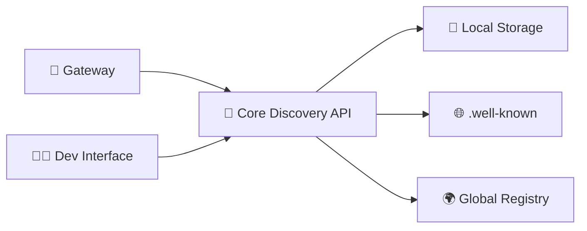

# 🔍 Discovery API - Interface de Test pour Développeurs

> **API Backend pour le Gateway** - Interface de test pour développeurs qui simule comment le Gateway utilise le Discovery Engine

## 🎯 Objectif

Cette interface remplace l'ancienne interface "utilisateur final" par une **interface de test d'API** orientée **développeurs** et **DevOps**. Elle simule exactement comment le Gateway interroge le Core Discovery.

## 🏗️ Architecture



**Discovery = API Backend**, pas interface utilisateur !

## ⚡ Tests Rapides (Scénarios Gateway)

### 💳 Besoin Billing
Simule un Gateway cherchant des agents pour traiter un paiement :
```json
{
  "capabilities": ["billing", "payment"],
  "min_health_score": 80,
  "limit": 3
}
```

### 🎧 Besoin Support  
Agents support client disponibles :
```json
{
  "capabilities": ["support", "customer-service"],
  "min_health_score": 70,
  "limit": 5
}
```

### 💚 Prod-Ready Only
Filtre par santé pour production :
```json
{
  "min_health_score": 85,
  "health_status": ["healthy"]
}
```

### 🔄 Fallback Strategy
Alternatives si agent principal fail :
```json
{
  "capabilities": ["billing"],
  "min_health_score": 60,
  "limit": 10
}
```

## 🔧 APIs Disponibles

### POST /api/discover
API principale pour le Gateway - trouve les meilleurs agents selon les critères

**Paramètres :**
- `capabilities`: Array de capabilities requises
- `status`: Statuts acceptés (active, maintenance, inactive)
- `health_status`: Santé requise (healthy, degraded, unhealthy)
- `min_health_score`: Score minimum (0-100)
- `limit`: Nombre maximum de résultats
- `organization`: Organisation spécifique
- `discovery_level`: Niveau de découverte (public, internal, private)
- `include_local`: Inclure stockage local
- `include_wellknown`: Inclure discovery .well-known
- `include_global`: Inclure registre global

### GET /api/search/{query}
Recherche textuelle simple dans tous les agents

### GET /api/healthy
Agents en bonne santé seulement (pour production)

### GET /api/capabilities/{caps}
Trouve agents par capabilities spécifiques

## 📊 Format de Réponse

```json
{
  "agents": [
    {
      "agent_uri": "agent://billing.stripe.com",
      "endpoint": "https://api.stripe.com/agents/billing",
      "status": "active",
      "capabilities": ["billing", "payment"],
      "health": {
        "status": "healthy",
        "score": 95,
        "response_time_ms": 120
      }
    }
  ],
  "sources": [
    {
      "name": "local-storage",
      "type": "local", 
      "agents_found": 2,
      "response_time_ms": 15
    }
  ],
  "total_found": 2,
  "query_time_ms": 45,
  "metadata": {
    "local_agents": 2,
    "wellknown_agents": 0,
    "global_agents": 0,
    "filtered_out": 0,
    "health_checked": 2
  }
}
```

## 🚀 Utilisation Gateway

Exemple typique d'utilisation par le Gateway :

```typescript
// Gateway fait une requête au Core Discovery
const agents = await core.discover({
  capabilities: ['billing', 'payment'],
  health_status: ['healthy'],
  min_health_score: 80,
  limit: 3
});

// Gateway choisit le meilleur et fait un fallback automatique
for (const agent of agents) {
  try {
    return await gateway.callAgent(agent, userMessage);
  } catch (error) {
    continue; // Essaie le suivant
  }
}
```

## 💡 Interface Utilisateur

L'interface offre :

1. **Tests rapides** - Scénarios Gateway prédéfinis
2. **Interface POST /api/discover** - Formulaire complet avec tous les paramètres
3. **APIs complémentaires** - Tests rapides pour search, healthy, capabilities
4. **Réponse formatée** - JSON avec coloration syntaxique
5. **Métriques temps réel** - Agents trouvés, temps requête, sources utilisées
6. **Génération cURL** - Pour copier-coller dans le terminal

## 🎨 Style Développeur

- **Thème sombre** avec Monaco monospace
- **Coloration JSON** pour les réponses
- **Métriques de performance** en temps réel
- **Badges de statut** HTTP (200 OK, 500 Error)
- **Interface terminal-like** pour les développeurs

## 🔗 Intégration

Cette interface permet de :

- **Tester l'API Discovery** avant d'intégrer le Gateway
- **Débugger les problèmes** de résolution
- **Optimiser les performances** avec les métriques
- **Valider les requêtes** Gateway
- **Générer des cURL** pour les tests automatisés

## 🎯 Différences avec l'Ancienne Interface

| Ancienne Interface | Nouvelle Interface |
|---|---|
| ❌ Orientée utilisateur final | ✅ Orientée développeur |
| ❌ Trop de choix visuels | ✅ Interface API précise |
| ❌ "Découverte exploratoire" | ✅ Tests Gateway simulés |
| ❌ Style classique | ✅ Thème terminal sombre |

## 📈 Prochaines Étapes

1. **Gateway Implementation** - Utiliser cette API dans le Gateway
2. **Monitoring Intégration** - Connecter les métriques à un dashboard
3. **Load Testing** - Tester la performance sous charge  
4. **CI/CD Integration** - Tests automatisés de l'API Discovery 